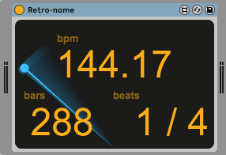

# Retro-nome

## Download
https://maxforlive.com/library/device/6723/retro-nome 
see [releases](https://github.com/h1data/M4L-Retro-nome/releases) for old versions

## What is this?
A simple Max for Live visualization of the classic metronome.

## Known issues
see [Issues](https://github.com/h1data/M4L-Retro-nome/issues?q=)
